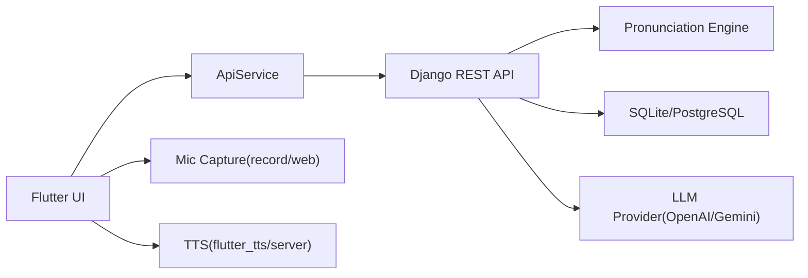

# 시나브로 (Onsaemiro) - Flutter Client

탈북민의 남한 표준어 적응을 돕는 학습 앱 프론트엔드입니다.  
웹/모바일(iOS)에서 단어, 문장, 억양 학습과 발음 평가를 제공합니다.

## 배포 주소

- Web: [https://satoori.protfolio.store](https://satoori.protfolio.store)
- API: [https://satoori-api.protfolio.store/api](https://satoori-api.protfolio.store/api)

## 핵심 기능

- 챕터 기반 학습 루틴: 단어 학습, 문장 학습, 억양 학습
- 직접 말하기 평가: 실시간 입력 레벨/피치 표시, 자동 종료, 수동 중단/취소
- 발음 평가 리포트: 점수, 피드백, 속도/피치/음량 지표
- AI 대화: 언어 차이 질문 응답, 실패 복구 UX(재시도/초기화)
- 관리자 콘솔: 이미지/챕터/단어/문장 관리
- 복습 추천 큐: 최근 점수 기반 개인화 정렬

## 기술 스택

- Flutter 3.x
- 상태 관리: `provider`
- 음성 입력: `record`, `speech_to_text`, 브라우저 녹음 fallback
- 음성 출력: `flutter_tts`, 서버 TTS fallback
- 네트워크: `http` multipart 업로드

## 아키텍처 요약



## 실행 방법

### 1) 로컬 개발

```bash
cd /Users/LSY/dev/깃헙/pj_flutter
flutter pub get
flutter run --dart-define=API_BASE_URL=http://127.0.0.1:8000/api
```

### 2) 운영 API 연결

```bash
flutter run --release --dart-define=API_BASE_URL=https://satoori-api.protfolio.store/api
```

### 3) 웹 빌드

```bash
flutter build web --release --dart-define=API_BASE_URL=https://satoori-api.protfolio.store/api
```

## iOS 릴리즈 참고

- 가이드: `/Users/LSY/dev/깃헙/pj_flutter/IOS_RELEASE.md`
- 프리플라이트: `/Users/LSY/dev/깃헙/pj_flutter/scripts/ios_release_prep.sh`

## 포트폴리오 문서

- 케이스 스터디: `/Users/LSY/dev/깃헙/pj_flutter/docs/PORTFOLIO_CASE_STUDY_KR.md`
- 면접 요약 1페이지: `/Users/LSY/dev/깃헙/pj_flutter/docs/INTERVIEW_ONE_PAGE_KR.md`
- 블로그 시리즈 구조: `/Users/LSY/dev/깃헙/pj_flutter/docs/BLOG_SERIES_KR.md`
- 제출 체크리스트: `/Users/LSY/dev/깃헙/pj_flutter/docs/PORTFOLIO_SUBMISSION_CHECKLIST_KR.md`
