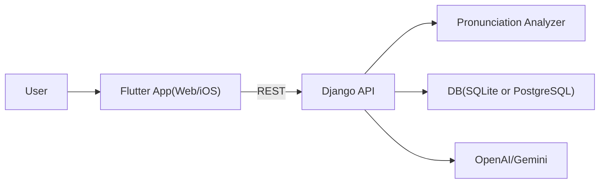

# 시나브로 포트폴리오 케이스 스터디 (KR)

## 1. 프로젝트 한 줄 소개

탈북민의 남한 표준어 적응을 위해, 실제 발화를 기반으로 발음/억양을 평가하고 복습 루틴까지 연결하는 학습 서비스.

## 2. 해결하려던 문제

- 단순 단어 암기 앱은 실전 발화 교정까지 연결되지 않음
- 모바일 웹/앱 환경에서 마이크 권한, 녹음 포맷, 브라우저 정책 이슈가 빈번함
- 학습자가 "지금 내 발화가 제대로 들어가고 있는지" 즉시 확인하기 어려움

## 3. 내가 구현한 해결책

- 직접 말하기 중 실시간 음성 레벨/피치 시각화
- 발화 종료 자동 감지 + 사용자가 수동 중단/취소 가능한 이중 제어
- 녹음 포맷 및 플랫폼별 fallback(`m4a/webm/wav/ogg`) 처리
- 평가 지표를 텍스트 기반이 아니라 음성 특성(속도/피치/음량) 중심으로 산출
- 실패 시 blocking popup 최소화 및 재시도 가능한 UX로 개선

## 4. 기술적 난제와 해결

### A. iOS Safari 마이크 제약

- 문제: 권한 팝업/녹음 초기화가 브라우저 정책에 따라 불안정
- 해결: 웹/네이티브별 녹음 경로 분리, 진단 정보 UI 노출, 파일 업로드 fallback 제공

### B. "녹음된 음성이 없습니다" 간헐 오류

- 문제: 녹음 stop 직후 파일 flush 타이밍 경쟁
- 해결: 파일 읽기 재시도(backoff) 로직 추가로 빈 바이트 실패율 완화

### C. 사용자 체감 UX

- 문제: 로딩/오류 팝업으로 화면 조작이 막힘
- 해결: snackbar + 상세 bottom sheet 방식으로 non-blocking 흐름 전환

## 5. 서비스 흐름

1. 학습자 챕터 선택
2. 직접 말하기로 음성 입력
3. 실시간 상태 확인(레벨/피치/STT 텍스트)
4. 평가 요청 및 점수/피드백 반환
5. 추천 복습 큐 자동 정렬

## 6. 아키텍처

## 7. 운영/배포

- GitHub Actions + Self-hosted Runner
- Docker Compose 기반 무중단 재배포
- Nginx Reverse Proxy + HTTPS
- 도메인: `satoori.protfolio.store`, `satoori-api.protfolio.store`

## 8. 포트폴리오에서 강조할 포인트

- 기능 구현이 아니라 "문제-원인-해결-검증" 순서로 설명
- iOS/웹 음성 제약을 회피가 아닌 제품 UX로 흡수한 점
- 배포 자동화까지 포함한 실제 운영형 프로젝트라는 점

## 9. 다음 확장 계획

- 로그인/계정별 학습 데이터 완전 분리
- 발화 세션 히스토리 및 장기 추세 리포트
- TestFlight/스토어 배포 및 Crash/Analytics 연동
